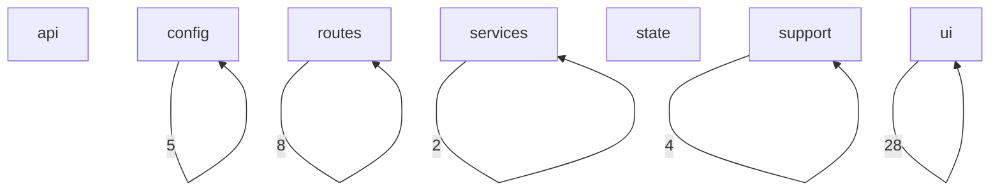
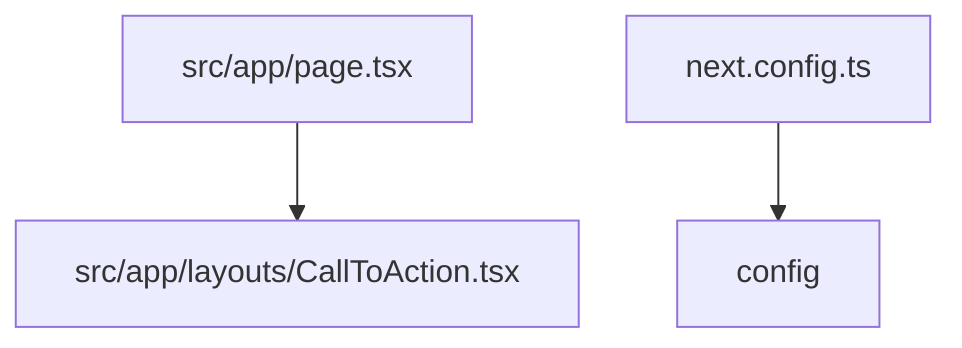
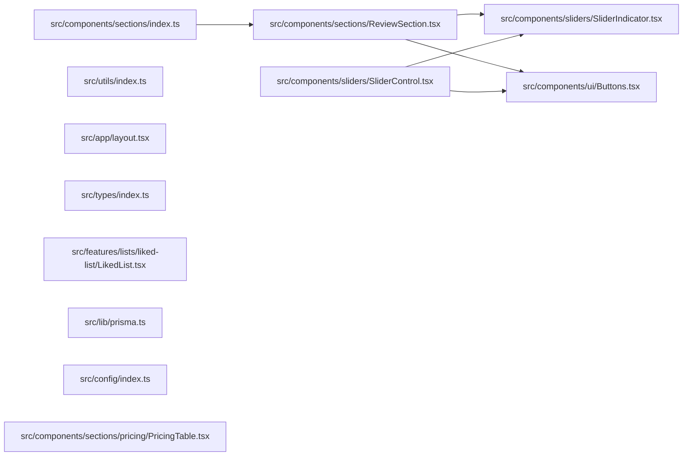

# Flow

## Flow Document Purpose

- Repository: `aura-stream-next`
- Category: `frontend`
- This document explains how the codebase is wired together using actual local file imports when
  they are available.
- Folder names and path categories are used only as a fallback when an exact runtime link is not
  directly visible from source imports.
- Mermaid diagrams below are repository-local diagrams intended for scanning architecture flow, not
  pixel-perfect runtime sequence diagrams.
- External services are called out only when the repository declares them in code or package
  metadata.

## Reading Guide

- `Entry points` are files that appear to bootstrap the app, server, router, or top-level runtime.
- `Outgoing links` are local repository imports from one file to another.
- `Incoming links` are local repository files that import the current file.
- `External packages` are package imports seen in source files and are listed separately from local
  file links.
- `Flow position` is derived from the file category plus observed import relationships.

## Repository Surface Snapshot

- Total scanned files: `180`
- Files with local outgoing imports: `26`
- Files with local incoming imports: `39`
- Root directories: `5`
- Root files: `14`
- Category count: `7`

## Top-Level Directories

- `.vscode/`
- `docs/`
- `prisma/`
- `public/`
- `src/`

## Top-Level Files

- `.gitignore`
- `.prettierrc`
- `DOCS.md`
- `README.md`
- `eslint.config.mjs`
- `middelware.ts`
- `next-env.d.ts`
- `next.config.ts`
- `package.json`
- `parse-tsprune.ts`
- `pnpm-lock.yaml`
- `pnpm-workspace.yaml`
- `postcss.config.mjs`
- `tsconfig.json`

## Category Inventory

- `api`: `14` files
- `config`: `17` files
- `routes`: `33` files
- `services`: `10` files
- `state`: `8` files
- `support`: `13` files
- `ui`: `85` files

## Entry Points

- `src/app/page.tsx`
- `next.config.ts`

## Category-Level Diagram

## Entry Flow Diagram

## Hotspot File Diagram

## Category Flow Notes

- `api` exports `0` observed category-to-category local links and receives `0` incoming category
  links
- `config` exports `5` observed category-to-category local links and receives `5` incoming category
  links
- `routes` exports `8` observed category-to-category local links and receives `8` incoming category
  links
- `services` exports `2` observed category-to-category local links and receives `2` incoming
  category links
- `state` exports `0` observed category-to-category local links and receives `0` incoming category
  links
- `support` exports `4` observed category-to-category local links and receives `4` incoming category
  links
- `ui` exports `28` observed category-to-category local links and receives `28` incoming category
  links

## File-Level Flow Inventory

### `api` Layer

- File: `src/app/api/auth/callback/route.ts`
- Flow position: `api`
- Local outgoing link count: `0`
- Outgoing -> `None confirmed from local imports`
- Local incoming link count: `0`
- Incoming <- `None confirmed from local imports`
- External package link count: `3`
- External -> `@/lib/auth`
- External -> `@/lib/prisma`
- External -> `next/navigation`
-
- File: `src/app/api/auth/login/route.ts`
- Flow position: `api`
- Local outgoing link count: `0`
- Outgoing -> `None confirmed from local imports`
- Local incoming link count: `0`
- Incoming <- `None confirmed from local imports`
- External package link count: `2`
- External -> `@/lib/auth`
- External -> `next/server`
-
- File: `src/app/api/auth/logout/route.ts`
- Flow position: `api`
- Local outgoing link count: `0`
- Outgoing -> `None confirmed from local imports`
- Local incoming link count: `0`
- Incoming <- `None confirmed from local imports`
- External package link count: `2`
- External -> `@/lib/auth`
- External -> `next/server`
-
- File: `src/app/api/auth/me/route.ts`
- Flow position: `api`
- Local outgoing link count: `0`
- Outgoing -> `None confirmed from local imports`
- Local incoming link count: `0`
- Incoming <- `None confirmed from local imports`
- External package link count: `2`
- External -> `@/lib/auth`
- External -> `next/server`
-
- File: `src/app/api/auth/register/route.ts`
- Flow position: `api`
- Local outgoing link count: `0`
- Outgoing -> `None confirmed from local imports`
- Local incoming link count: `0`
- Incoming <- `None confirmed from local imports`
- External package link count: `2`
- External -> `@/lib/auth`
- External -> `next/server`
-
- File: `src/app/api/browse/movies/[id]/route.ts`
- Flow position: `api`
- Local outgoing link count: `0`
- Outgoing -> `None confirmed from local imports`
- Local incoming link count: `0`
- Incoming <- `None confirmed from local imports`
- External package link count: `2`
- External -> `@/lib/tmdb`
- External -> `next/server`
-
- File: `src/app/api/browse/route.ts`
- Flow position: `api`
- Local outgoing link count: `0`
- Outgoing -> `None confirmed from local imports`
- Local incoming link count: `0`
- Incoming <- `None confirmed from local imports`
- External package link count: `3`
- External -> `fs/promises`
- External -> `next/server`
- External -> `path`
-
- File: `src/app/api/browse/shows/[id]/route.ts`
- Flow position: `api`
- Local outgoing link count: `0`
- Outgoing -> `None confirmed from local imports`
- Local incoming link count: `0`
- Incoming <- `None confirmed from local imports`
- External package link count: `2`
- External -> `@/lib/tmdb`
- External -> `next/server`
-
- File: `src/app/api/db-stats/route.ts`
- Flow position: `api`
- Local outgoing link count: `0`
- Outgoing -> `None confirmed from local imports`
- Local incoming link count: `0`
- Incoming <- `None confirmed from local imports`
- External package link count: `2`
- External -> `@/lib/db/queries/getDbStats`
- External -> `next/server`
-
- File: `src/app/api/discover/route.ts`
- Flow position: `api`
- Local outgoing link count: `0`
- Outgoing -> `None confirmed from local imports`
- Local incoming link count: `0`
- Incoming <- `None confirmed from local imports`
- External package link count: `1`
- External -> `next/server`
-
- File: `src/app/api/popular/route.ts`
- Flow position: `api`
- Local outgoing link count: `0`
- Outgoing -> `None confirmed from local imports`
- Local incoming link count: `0`
- Incoming <- `None confirmed from local imports`
- External package link count: `1`
- External -> `next/server`
-
- File: `src/app/api/register/route.ts`
- Flow position: `api`
- Local outgoing link count: `0`
- Outgoing -> `None confirmed from local imports`
- Local incoming link count: `0`
- Incoming <- `None confirmed from local imports`
- External package link count: `3`
- External -> `@/lib/prisma`
- External -> `bcryptjs`
- External -> `next/server`
-
- File: `src/app/api/search/route.ts`
- Flow position: `api`
- Local outgoing link count: `0`
- Outgoing -> `None confirmed from local imports`
- Local incoming link count: `0`
- Incoming <- `None confirmed from local imports`
- External package link count: `1`
- External -> `next/server`
-
- File: `src/app/api/tables/route.ts`
- Flow position: `api`
- Local outgoing link count: `0`
- Outgoing -> `None confirmed from local imports`
- Local incoming link count: `0`
- Incoming <- `None confirmed from local imports`
- External package link count: `2`
- External -> `@/lib/db/queries/getDataTables`
- External -> `next/server`
-

### `config` Layer

- File: `eslint.config.mjs`
- Flow position: `config`
- Local outgoing link count: `0`
- Outgoing -> `None confirmed from local imports`
- Local incoming link count: `0`
- Incoming <- `None confirmed from local imports`
- External package link count: `3`
- External -> `@eslint/eslintrc`
- External -> `path`
- External -> `url`
-
- File: `next.config.ts`
- Flow position: `config`
- Local outgoing link count: `0`
- Outgoing -> `None confirmed from local imports`
- Local incoming link count: `0`
- Incoming <- `None confirmed from local imports`
- External package link count: `1`
- External -> `next`
-
- File: `postcss.config.mjs`
- Flow position: `config`
- Local outgoing link count: `0`
- Outgoing -> `None confirmed from local imports`
- Local incoming link count: `0`
- Incoming <- `None confirmed from local imports`
- External -> `None confirmed from import statements`
-
- File: `prisma/schema.prisma`
- Flow position: `config`
- Local outgoing link count: `0`
- Outgoing -> `None confirmed from local imports`
- Local incoming link count: `0`
- Incoming <- `None confirmed from local imports`
- External -> `None confirmed from import statements`
-
- File: `src/config/appConfig.ts`
- Flow position: `config`
- Local outgoing link count: `0`
- Outgoing -> `None confirmed from local imports`
- Local incoming link count: `1`
- Incoming <- `src/config/index.ts`
- External package link count: `2`
- External -> `next`
- External -> `next/font/google`
-
- File: `src/config/categories.ts`
- Flow position: `config`
- Local outgoing link count: `0`
- Outgoing -> `None confirmed from local imports`
- Local incoming link count: `0`
- Incoming <- `None confirmed from local imports`
- External -> `None confirmed from import statements`
-
- File: `src/config/env.ts`
- Flow position: `config`
- Local outgoing link count: `0`
- Outgoing -> `None confirmed from local imports`
- Local incoming link count: `0`
- Incoming <- `None confirmed from local imports`
- External package link count: `1`
- External -> `zod`
-
- File: `src/config/index.ts`
- Flow position: `config`
- Local outgoing link count: `2`
- Outgoing -> `src/config/appConfig.ts`
- Outgoing -> `src/config/navlinks.ts`
- Local incoming link count: `0`
- Incoming <- `None confirmed from local imports`
- External -> `None confirmed from import statements`
-
- File: `src/config/mock.ts`
- Flow position: `config`
- Local outgoing link count: `0`
- Outgoing -> `None confirmed from local imports`
- Local incoming link count: `0`
- Incoming <- `None confirmed from local imports`
- External -> `None confirmed from import statements`
-
- File: `src/config/navlinks.ts`
- Flow position: `config`
- Local outgoing link count: `0`
- Outgoing -> `None confirmed from local imports`
- Local incoming link count: `1`
- Incoming <- `src/config/index.ts`
- External -> `None confirmed from import statements`
-
- File: `src/types/components.ts`
- Flow position: `config`
- Local outgoing link count: `0`
- Outgoing -> `None confirmed from local imports`
- Local incoming link count: `0`
- Incoming <- `None confirmed from local imports`
- External package link count: `1`
- External -> `@/components/common/QuickActions`
-
- File: `src/types/genre.ts`
- Flow position: `config`
- Local outgoing link count: `0`
- Outgoing -> `None confirmed from local imports`
- Local incoming link count: `1`
- Incoming <- `src/types/index.ts`
- External -> `None confirmed from import statements`
-
- File: `src/types/index.ts`
- Flow position: `config`
- Local outgoing link count: `3`
- Outgoing -> `src/types/genre.ts`
- Outgoing -> `src/types/lists.ts`
- Outgoing -> `src/types/mock.ts`
- Local incoming link count: `0`
- Incoming <- `None confirmed from local imports`
- External -> `None confirmed from import statements`
-
- File: `src/types/lists.ts`
- Flow position: `config`
- Local outgoing link count: `0`
- Outgoing -> `None confirmed from local imports`
- Local incoming link count: `1`
- Incoming <- `src/types/index.ts`
- External -> `None confirmed from import statements`
-
- File: `src/types/mock.ts`
- Flow position: `config`
- Local outgoing link count: `0`
- Outgoing -> `None confirmed from local imports`
- Local incoming link count: `1`
- Incoming <- `src/types/index.ts`
- External -> `None confirmed from import statements`
-
- File: `src/types/tmdb.ts`
- Flow position: `config`
- Local outgoing link count: `0`
- Outgoing -> `None confirmed from local imports`
- Local incoming link count: `0`
- Incoming <- `None confirmed from local imports`
- External -> `None confirmed from import statements`
-
- File: `tsconfig.json`
- Flow position: `config`
- Local outgoing link count: `0`
- Outgoing -> `None confirmed from local imports`
- Local incoming link count: `0`
- Incoming <- `None confirmed from local imports`
- External -> `None confirmed from import statements`
-

### `routes` Layer

- File: `src/app/(auth)/login/page.tsx`
- Flow position: `routes`
- Local outgoing link count: `0`
- Outgoing -> `None confirmed from local imports`
- Local incoming link count: `0`
- Incoming <- `None confirmed from local imports`
- External package link count: `9`
- External -> `@/app/store/useAuth`
- External -> `@/app/store/useDialogStore`
- External -> `@/components/feedback/Maintance`
- External -> `@/components/ui/AuraButton`
- External -> `@/components/ui/Buttons`
- External -> `@/lib/toast`
- External -> `next/link`
- External -> `next/navigation`
- External -> `react`
-
- File: `src/app/(auth)/register/page.tsx`
- Flow position: `routes`
- Local outgoing link count: `0`
- Outgoing -> `None confirmed from local imports`
- Local incoming link count: `0`
- Incoming <- `None confirmed from local imports`
- External package link count: `11`
- External -> `@/app/store/useAuth`
- External -> `@/app/store/useDialogStore`
- External -> `@/components/feedback/Maintance`
- External -> `@/components/ui/AuraButton`
- External -> `@/components/ui/Buttons`
- External -> `@/lib/toast`
- External -> `@hookform/resolvers/zod`
- External -> `next/link`
- External -> `next/navigation`
- External -> `react-hook-form`
- External -> `zod`
-
- File: `src/app/AppLoaderWrapper.tsx`
- Flow position: `routes`
- Local outgoing link count: `0`
- Outgoing -> `None confirmed from local imports`
- Local incoming link count: `1`
- Incoming <- `src/app/layout.tsx`
- External package link count: `2`
- External -> `@/components/loaders/AppLoader`
- External -> `react`
-
- File: `src/app/browse/movies/[id]/page.tsx`
- Flow position: `routes`
- Local outgoing link count: `0`
- Outgoing -> `None confirmed from local imports`
- Local incoming link count: `0`
- Incoming <- `None confirmed from local imports`
- External package link count: `2`
- External -> `@/components/sections/MovieReview`
- External -> `@/features/SingleMovieHero`
-
- File: `src/app/browse/page.tsx`
- Flow position: `routes`
- Local outgoing link count: `0`
- Outgoing -> `None confirmed from local imports`
- Local incoming link count: `0`
- Incoming <- `None confirmed from local imports`
- External package link count: `6`
- External -> `@/app/layouts/CallToAction`
- External -> `@/components/common/HeroSliderServer`
- External -> `@/components/sections/BrowseSection`
- External -> `@/lib/tmdb`
- External -> `next/image`
- External -> `next/link`
-
- File: `src/app/browse/shows/[id]/page.tsx`
- Flow position: `routes`
- Local outgoing link count: `0`
- Outgoing -> `None confirmed from local imports`
- Local incoming link count: `0`
- Incoming <- `None confirmed from local imports`
- External package link count: `3`
- External -> `@/features/SingleMovieHero`
- External -> `@/features/details/ShowDetailsClient`
- External -> `@/lib/tmdb`
-
- File: `src/app/dashboard/layout.tsx`
- Flow position: `routes`
- Local outgoing link count: `0`
- Outgoing -> `None confirmed from local imports`
- Local incoming link count: `0`
- Incoming <- `None confirmed from local imports`
- External package link count: `2`
- External -> `@/components/auth/AuthGuard`
- External -> `next`
-
- File: `src/app/dashboard/liked/page.tsx`
- Flow position: `routes`
- Local outgoing link count: `0`
- Outgoing -> `None confirmed from local imports`
- Local incoming link count: `0`
- Incoming <- `None confirmed from local imports`
- External package link count: `4`
- External -> `@/app/store/useAuth`
- External -> `lucide-react`
- External -> `next/navigation`
- External -> `react`
-
- File: `src/app/dashboard/lists/page.tsx`
- Flow position: `routes`
- Local outgoing link count: `0`
- Outgoing -> `None confirmed from local imports`
- Local incoming link count: `0`
- Incoming <- `None confirmed from local imports`
- External package link count: `1`
- External -> `@/features/lists/FullList`
-
- File: `src/app/dashboard/page.tsx`
- Flow position: `routes`
- Local outgoing link count: `0`
- Outgoing -> `None confirmed from local imports`
- Local incoming link count: `0`
- Incoming <- `None confirmed from local imports`
- External package link count: `1`
- External -> `@/components/auth/ProtectedRoute`
-
- File: `src/app/dashboard/saved/page.tsx`
- Flow position: `routes`
- Local outgoing link count: `0`
- Outgoing -> `None confirmed from local imports`
- Local incoming link count: `0`
- Incoming <- `None confirmed from local imports`
- External package link count: `4`
- External -> `@/app/store/useAuth`
- External -> `lucide-react`
- External -> `next/navigation`
- External -> `react`
-
- File: `src/app/discovery/page.tsx`
- Flow position: `routes`
- Local outgoing link count: `0`
- Outgoing -> `None confirmed from local imports`
- Local incoming link count: `0`
- Incoming <- `None confirmed from local imports`
- External package link count: `1`
- External -> `@/components/ui/GenreGrid`
-
- File: `src/app/globals.css`
- Flow position: `routes`
- Local outgoing link count: `0`
- Outgoing -> `None confirmed from local imports`
- Local incoming link count: `1`
- Incoming <- `src/app/layout.tsx`
- External -> `None confirmed from import statements`
-
- File: `src/app/layout.tsx`
- Flow position: `routes`
- Local outgoing link count: `4`
- Outgoing -> `src/app/AppLoaderWrapper.tsx`
- Outgoing -> `src/app/globals.css`
- Outgoing -> `src/app/layouts/AppFooter.tsx`
- Outgoing -> `src/app/layouts/AppHeader.tsx`
- Local incoming link count: `0`
- Incoming <- `None confirmed from local imports`
- External package link count: `3`
- External -> `@/components/ui/toaster`
- External -> `@/config/appConfig`
- External -> `next`
-
- File: `src/app/layouts/AppFooter.tsx`
- Flow position: `routes`
- Local outgoing link count: `0`
- Outgoing -> `None confirmed from local imports`
- Local incoming link count: `1`
- Incoming <- `src/app/layout.tsx`
- External package link count: `2`
- External -> `@/config`
- External -> `next/link`
-
- File: `src/app/layouts/AppHeader.tsx`
- Flow position: `routes`
- Local outgoing link count: `0`
- Outgoing -> `None confirmed from local imports`
- Local incoming link count: `1`
- Incoming <- `src/app/layout.tsx`
- External package link count: `8`
- External -> `@/app/layouts/header/ActionPanel`
- External -> `@/app/layouts/header/Logo`
- External -> `@/app/layouts/header/MobileMenu`
- External -> `@/app/layouts/header/Navbar`
- External -> `@/app/store/uiStore`
- External -> `@/components/ui/Buttons`
- External -> `lucide-react`
- External -> `react`
-
- File: `src/app/layouts/CallToAction.tsx`
- Flow position: `routes`
- Local outgoing link count: `0`
- Outgoing -> `None confirmed from local imports`
- Local incoming link count: `2`
- Incoming <- `src/app/page.tsx`
- Incoming <- `src/app/support/page.tsx`
- External package link count: `1`
- External -> `@/components/ui/Buttons`
-
- File: `src/app/layouts/header/ActionPanel.tsx`
- Flow position: `routes`
- Local outgoing link count: `2`
- Outgoing -> `src/app/layouts/header/Notification.tsx`
- Outgoing -> `src/app/layouts/header/Search.tsx`
- Local incoming link count: `0`
- Incoming <- `None confirmed from local imports`
- External -> `None confirmed from import statements`
-
- File: `src/app/layouts/header/Logo.tsx`
- Flow position: `routes`
- Local outgoing link count: `0`
- Outgoing -> `None confirmed from local imports`
- Local incoming link count: `0`
- Incoming <- `None confirmed from local imports`
- External package link count: `1`
- External -> `next/link`
-
- File: `src/app/layouts/header/MobileMenu.tsx`
- Flow position: `routes`
- Local outgoing link count: `0`
- Outgoing -> `None confirmed from local imports`
- Local incoming link count: `0`
- Incoming <- `None confirmed from local imports`
- External package link count: `3`
- External -> `@/app/store/uiStore`
- External -> `@/config`
- External -> `next/link`
-
- File: `src/app/layouts/header/Navbar.tsx`
- Flow position: `routes`
- Local outgoing link count: `0`
- Outgoing -> `None confirmed from local imports`
- Local incoming link count: `0`
- Incoming <- `None confirmed from local imports`
- External package link count: `3`
- External -> `@/config`
- External -> `next/link`
- External -> `next/navigation`
-
- File: `src/app/layouts/header/Notification.tsx`
- Flow position: `routes`
- Local outgoing link count: `0`
- Outgoing -> `None confirmed from local imports`
- Local incoming link count: `1`
- Incoming <- `src/app/layouts/header/ActionPanel.tsx`
- External package link count: `6`
- External -> `@/app/store/notificationStore`
- External -> `@/components/ui/Badge`
- External -> `@/utils`
- External -> `lucide-react`
- External -> `next/link`
- External -> `react`
-
- File: `src/app/layouts/header/Search.tsx`
- Flow position: `routes`
- Local outgoing link count: `0`
- Outgoing -> `None confirmed from local imports`
- Local incoming link count: `1`
- Incoming <- `src/app/layouts/header/ActionPanel.tsx`
- External package link count: `4`
- External -> `@/app/store/uiStore`
- External -> `@/hooks/useDebounce`
- External -> `lucide-react`
- External -> `react`
-
- File: `src/app/page.tsx`
- Flow position: `routes`
- Local outgoing link count: `1`
- Outgoing -> `src/app/layouts/CallToAction.tsx`
- Local incoming link count: `0`
- Incoming <- `None confirmed from local imports`
- External package link count: `8`
- External -> `@/components/sections/BrowseSection`
- External -> `@/components/sections/DeviceSection`
- External -> `@/components/sections/FaqsSection`
- External -> `@/components/sections/hero/HomeHero`
- External -> `@/components/sections/pricing/PricingSection`
- External -> `@/components/sliders/carousels`
- External -> `@/config/categories`
- External -> `next/navigation`
-
- File: `src/app/store/notificationStore.ts`
- Flow position: `routes`
- Local outgoing link count: `0`
- Outgoing -> `None confirmed from local imports`
- Local incoming link count: `0`
- Incoming <- `None confirmed from local imports`
- External package link count: `1`
- External -> `zustand`
-
- File: `src/app/store/searchStore.ts`
- Flow position: `routes`
- Local outgoing link count: `0`
- Outgoing -> `None confirmed from local imports`
- Local incoming link count: `0`
- Incoming <- `None confirmed from local imports`
- External package link count: `1`
- External -> `zustand`
-
- File: `src/app/store/uiStore.ts`
- Flow position: `routes`
- Local outgoing link count: `0`
- Outgoing -> `None confirmed from local imports`
- Local incoming link count: `0`
- Incoming <- `None confirmed from local imports`
- External package link count: `1`
- External -> `zustand`
-
- File: `src/app/store/useAuth.ts`
- Flow position: `routes`
- Local outgoing link count: `0`
- Outgoing -> `None confirmed from local imports`
- Local incoming link count: `0`
- Incoming <- `None confirmed from local imports`
- External package link count: `2`
- External -> `zustand`
- External -> `zustand/middleware`
-
- File: `src/app/store/useCollectionStore.ts`
- Flow position: `routes`
- Local outgoing link count: `0`
- Outgoing -> `None confirmed from local imports`
- Local incoming link count: `0`
- Incoming <- `None confirmed from local imports`
- External package link count: `1`
- External -> `zustand`
-
- File: `src/app/store/useDialogStore.ts`
- Flow position: `routes`
- Local outgoing link count: `0`
- Outgoing -> `None confirmed from local imports`
- Local incoming link count: `0`
- Incoming <- `None confirmed from local imports`
- External package link count: `1`
- External -> `zustand`
-
- File: `src/app/subscriptions/page.tsx`
- Flow position: `routes`
- Local outgoing link count: `0`
- Outgoing -> `None confirmed from local imports`
- Local incoming link count: `0`
- Incoming <- `None confirmed from local imports`
- External package link count: `3`
- External -> `@/app/layouts/CallToAction`
- External -> `@/components/sections/pricing/PricingSection`
- External -> `@/components/sections/pricing/PricingTable`
-
- File: `src/app/support/page.tsx`
- Flow position: `routes`
- Local outgoing link count: `1`
- Outgoing -> `src/app/layouts/CallToAction.tsx`
- Local incoming link count: `0`
- Incoming <- `None confirmed from local imports`
- External package link count: `2`
- External -> `@/components/sections/FaqsSection`
- External -> `@/components/sections/hero/SupportHero`
-
- File: `src/app/watchlist/page.tsx`
- Flow position: `routes`
- Local outgoing link count: `0`
- Outgoing -> `None confirmed from local imports`
- Local incoming link count: `0`
- Incoming <- `None confirmed from local imports`
- External package link count: `1`
- External -> `@/features/lists/FullList`
-

### `services` Layer

- File: `src/lib/api.ts`
- Flow position: `services`
- Local outgoing link count: `0`
- Outgoing -> `None confirmed from local imports`
- Local incoming link count: `0`
- Incoming <- `None confirmed from local imports`
- External -> `None confirmed from import statements`
-
- File: `src/lib/auth.ts`
- Flow position: `services`
- Local outgoing link count: `0`
- Outgoing -> `None confirmed from local imports`
- Local incoming link count: `0`
- Incoming <- `None confirmed from local imports`
- External package link count: `4`
- External -> `@/lib`
- External -> `bcryptjs`
- External -> `crypto`
- External -> `next/headers`
-
- File: `src/lib/db/api.ts`
- Flow position: `services`
- Local outgoing link count: `1`
- Outgoing -> `src/lib/prisma.ts`
- Local incoming link count: `0`
- Incoming <- `None confirmed from local imports`
- External -> `None confirmed from import statements`
-
- File: `src/lib/db/queries/getDataTables.ts`
- Flow position: `services`
- Local outgoing link count: `0`
- Outgoing -> `None confirmed from local imports`
- Local incoming link count: `0`
- Incoming <- `None confirmed from local imports`
- External package link count: `1`
- External -> `@/lib/prisma`
-
- File: `src/lib/db/queries/getDbStats.ts`
- Flow position: `services`
- Local outgoing link count: `0`
- Outgoing -> `None confirmed from local imports`
- Local incoming link count: `0`
- Incoming <- `None confirmed from local imports`
- External package link count: `1`
- External -> `@/lib/prisma`
-
- File: `src/lib/index.ts`
- Flow position: `services`
- Local outgoing link count: `1`
- Outgoing -> `src/lib/prisma.ts`
- Local incoming link count: `0`
- Incoming <- `None confirmed from local imports`
- External -> `None confirmed from import statements`
-
- File: `src/lib/prisma.ts`
- Flow position: `services`
- Local outgoing link count: `0`
- Outgoing -> `None confirmed from local imports`
- Local incoming link count: `2`
- Incoming <- `src/lib/db/api.ts`
- Incoming <- `src/lib/index.ts`
- External -> `None confirmed from import statements`
-
- File: `src/lib/search.ts`
- Flow position: `services`
- Local outgoing link count: `0`
- Outgoing -> `None confirmed from local imports`
- Local incoming link count: `0`
- Incoming <- `None confirmed from local imports`
- External package link count: `2`
- External -> `fs`
- External -> `path`
-
- File: `src/lib/tmdb.ts`
- Flow position: `services`
- Local outgoing link count: `0`
- Outgoing -> `None confirmed from local imports`
- Local incoming link count: `0`
- Incoming <- `None confirmed from local imports`
- External package link count: `2`
- External -> `@/components/cards/CastCard`
- External -> `@/config/env`
-
- File: `src/lib/toast.ts`
- Flow position: `services`
- Local outgoing link count: `0`
- Outgoing -> `None confirmed from local imports`
- Local incoming link count: `0`
- Incoming <- `None confirmed from local imports`
- External package link count: `1`
- External -> `sonner`
-

### `state` Layer

- File: `src/hooks/useCollectionActions.ts`
- Flow position: `state`
- Local outgoing link count: `0`
- Outgoing -> `None confirmed from local imports`
- Local incoming link count: `0`
- Incoming <- `None confirmed from local imports`
- External package link count: `2`
- External -> `@/app/store/useCollectionStore`
- External -> `@/lib/db/api`
-
- File: `src/hooks/useDebounce.ts`
- Flow position: `state`
- Local outgoing link count: `0`
- Outgoing -> `None confirmed from local imports`
- Local incoming link count: `0`
- Incoming <- `None confirmed from local imports`
- External package link count: `1`
- External -> `react`
-
- File: `src/hooks/useIsMobile.ts`
- Flow position: `state`
- Local outgoing link count: `0`
- Outgoing -> `None confirmed from local imports`
- Local incoming link count: `0`
- Incoming <- `None confirmed from local imports`
- External package link count: `1`
- External -> `react`
-
- File: `src/hooks/useLocalStorage.ts`
- Flow position: `state`
- Local outgoing link count: `0`
- Outgoing -> `None confirmed from local imports`
- Local incoming link count: `0`
- Incoming <- `None confirmed from local imports`
- External package link count: `2`
- External -> `@/utils/localStorage`
- External -> `react`
-
- File: `src/hooks/usePagination.ts`
- Flow position: `state`
- Local outgoing link count: `0`
- Outgoing -> `None confirmed from local imports`
- Local incoming link count: `0`
- Incoming <- `None confirmed from local imports`
- External package link count: `1`
- External -> `react`
-
- File: `src/hooks/useSlider.ts`
- Flow position: `state`
- Local outgoing link count: `0`
- Outgoing -> `None confirmed from local imports`
- Local incoming link count: `0`
- Incoming <- `None confirmed from local imports`
- External package link count: `1`
- External -> `react`
-
- File: `src/hooks/useVolumeControl.ts`
- Flow position: `state`
- Local outgoing link count: `0`
- Outgoing -> `None confirmed from local imports`
- Local incoming link count: `0`
- Incoming <- `None confirmed from local imports`
- External package link count: `1`
- External -> `react`
-
- File: `src/providers/PaginationProvider.tsx`
- Flow position: `state`
- Local outgoing link count: `0`
- Outgoing -> `None confirmed from local imports`
- Local incoming link count: `0`
- Incoming <- `None confirmed from local imports`
- External package link count: `1`
- External -> `react`
-

### `support` Layer

- File: `middelware.ts`
- Flow position: `support`
- Local outgoing link count: `0`
- Outgoing -> `None confirmed from local imports`
- Local incoming link count: `0`
- Incoming <- `None confirmed from local imports`
- External package link count: `2`
- External -> `@/lib/prisma`
- External -> `next/server`
-
- File: `next-env.d.ts`
- Flow position: `support`
- Local outgoing link count: `0`
- Outgoing -> `None confirmed from local imports`
- Local incoming link count: `0`
- Incoming <- `None confirmed from local imports`
- External -> `None confirmed from import statements`
-
- File: `package.json`
- Flow position: `support`
- Local outgoing link count: `0`
- Outgoing -> `None confirmed from local imports`
- Local incoming link count: `0`
- Incoming <- `None confirmed from local imports`
- External -> `None confirmed from import statements`
-
- File: `parse-tsprune.ts`
- Flow position: `support`
- Local outgoing link count: `0`
- Outgoing -> `None confirmed from local imports`
- Local incoming link count: `0`
- Incoming <- `None confirmed from local imports`
- External package link count: `1`
- External -> `fs`
-
- File: `pnpm-lock.yaml`
- Flow position: `support`
- Local outgoing link count: `0`
- Outgoing -> `None confirmed from local imports`
- Local incoming link count: `0`
- Incoming <- `None confirmed from local imports`
- External -> `None confirmed from import statements`
-
- File: `pnpm-workspace.yaml`
- Flow position: `support`
- Local outgoing link count: `0`
- Outgoing -> `None confirmed from local imports`
- Local incoming link count: `0`
- Incoming <- `None confirmed from local imports`
- External -> `None confirmed from import statements`
-
- File: `src/data/content.ts`
- Flow position: `support`
- Local outgoing link count: `0`
- Outgoing -> `None confirmed from local imports`
- Local incoming link count: `0`
- Incoming <- `None confirmed from local imports`
- External package link count: `1`
- External -> `@/types`
-
- File: `src/utils/actions.ts`
- Flow position: `support`
- Local outgoing link count: `0`
- Outgoing -> `None confirmed from local imports`
- Local incoming link count: `1`
- Incoming <- `src/utils/index.ts`
- External package link count: `2`
- External -> `@/components/common/QuickActions`
- External -> `lucide-react`
-
- File: `src/utils/formatters.ts`
- Flow position: `support`
- Local outgoing link count: `0`
- Outgoing -> `None confirmed from local imports`
- Local incoming link count: `1`
- Incoming <- `src/utils/index.ts`
- External -> `None confirmed from import statements`
-
- File: `src/utils/index.ts`
- Flow position: `support`
- Local outgoing link count: `4`
- Outgoing -> `src/utils/actions.ts`
- Outgoing -> `src/utils/formatters.ts`
- Outgoing -> `src/utils/localStorage.ts`
- Outgoing -> `src/utils/twUtil.ts`
- Local incoming link count: `0`
- Incoming <- `None confirmed from local imports`
- External -> `None confirmed from import statements`
-
- File: `src/utils/localStorage.ts`
- Flow position: `support`
- Local outgoing link count: `0`
- Outgoing -> `None confirmed from local imports`
- Local incoming link count: `1`
- Incoming <- `src/utils/index.ts`
- External -> `None confirmed from import statements`
-
- File: `src/utils/supabase.ts`
- Flow position: `support`
- Local outgoing link count: `0`
- Outgoing -> `None confirmed from local imports`
- Local incoming link count: `0`
- Incoming <- `None confirmed from local imports`
- External package link count: `1`
- External -> `@supabase/supabase-js`
-
- File: `src/utils/twUtil.ts`
- Flow position: `support`
- Local outgoing link count: `0`
- Outgoing -> `None confirmed from local imports`
- Local incoming link count: `1`
- Incoming <- `src/utils/index.ts`
- External package link count: `2`
- External -> `clsx`
- External -> `tailwind-merge`
-

### `ui` Layer

- File: `src/components/auth/AuthGuard.tsx`
- Flow position: `ui`
- Local outgoing link count: `0`
- Outgoing -> `None confirmed from local imports`
- Local incoming link count: `0`
- Incoming <- `None confirmed from local imports`
- External package link count: `3`
- External -> `@/app/store/useAuth`
- External -> `next/navigation`
- External -> `react`
-
- File: `src/components/auth/ProtectedRoute.tsx`
- Flow position: `ui`
- Local outgoing link count: `0`
- Outgoing -> `None confirmed from local imports`
- Local incoming link count: `0`
- Incoming <- `None confirmed from local imports`
- External package link count: `3`
- External -> `@/app/store/useAuth`
- External -> `next/navigation`
- External -> `react`
-
- File: `src/components/cards/CastCard.tsx`
- Flow position: `ui`
- Local outgoing link count: `0`
- Outgoing -> `None confirmed from local imports`
- Local incoming link count: `0`
- Incoming <- `None confirmed from local imports`
- External -> `None confirmed from import statements`
-
- File: `src/components/cards/ContentCard.tsx`
- Flow position: `ui`
- Local outgoing link count: `0`
- Outgoing -> `None confirmed from local imports`
- Local incoming link count: `0`
- Incoming <- `None confirmed from local imports`
- External package link count: `1`
- External -> `next/image`
-
- File: `src/components/cards/DescriptionCard.tsx`
- Flow position: `ui`
- Local outgoing link count: `0`
- Outgoing -> `None confirmed from local imports`
- Local incoming link count: `0`
- Incoming <- `None confirmed from local imports`
- External package link count: `1`
- External -> `@/utils`
-
- File: `src/components/cards/DeviceCard.tsx`
- Flow position: `ui`
- Local outgoing link count: `0`
- Outgoing -> `None confirmed from local imports`
- Local incoming link count: `1`
- Incoming <- `src/components/sections/DeviceSection.tsx`
- External package link count: `2`
- External -> `@/components/ui/Tags`
- External -> `@/utils`
-
- File: `src/components/cards/EpisodeCard.tsx`
- Flow position: `ui`
- Local outgoing link count: `0`
- Outgoing -> `None confirmed from local imports`
- Local incoming link count: `0`
- Incoming <- `None confirmed from local imports`
- External package link count: `4`
- External -> `@/components/ui/Tags`
- External -> `@/types/components`
- External -> `lucide-react`
- External -> `next/image`
-
- File: `src/components/cards/FaqCard.tsx`
- Flow position: `ui`
- Local outgoing link count: `1`
- Outgoing -> `src/components/ui/Buttons.tsx`
- Local incoming link count: `0`
- Incoming <- `None confirmed from local imports`
- External package link count: `4`
- External -> `@/components/ui/Divider`
- External -> `@/components/ui/Tags`
- External -> `@/types`
- External -> `lucide-react`
-
- File: `src/components/cards/GenreCard.tsx`
- Flow position: `ui`
- Local outgoing link count: `0`
- Outgoing -> `None confirmed from local imports`
- Local incoming link count: `0`
- Incoming <- `None confirmed from local imports`
- External package link count: `5`
- External -> `@/components/images/ImageGrid`
- External -> `@/components/ui/Badge`
- External -> `@/types`
- External -> `@/utils`
- External -> `lucide-react`
-
- File: `src/components/cards/PersonaCard.tsx`
- Flow position: `ui`
- Local outgoing link count: `0`
- Outgoing -> `None confirmed from local imports`
- Local incoming link count: `0`
- Incoming <- `None confirmed from local imports`
- External package link count: `2`
- External -> `@/types/components`
- External -> `lucide-react`
-
- File: `src/components/cards/PricingCard.tsx`
- Flow position: `ui`
- Local outgoing link count: `0`
- Outgoing -> `None confirmed from local imports`
- Local incoming link count: `0`
- Incoming <- `None confirmed from local imports`
- External package link count: `3`
- External -> `@/components/ui/Buttons`
- External -> `@/types/mock`
- External -> `@/utils`
-
- File: `src/components/cards/ReleasedYearCard.tsx`
- Flow position: `ui`
- Local outgoing link count: `0`
- Outgoing -> `None confirmed from local imports`
- Local incoming link count: `0`
- Incoming <- `None confirmed from local imports`
- External -> `None confirmed from import statements`
-
- File: `src/components/cards/ReviewCard.tsx`
- Flow position: `ui`
- Local outgoing link count: `0`
- Outgoing -> `None confirmed from local imports`
- Local incoming link count: `1`
- Incoming <- `src/components/sections/ReviewSection.tsx`
- External package link count: `3`
- External -> `@/components/common/StarRating`
- External -> `@/utils`
- External -> `react`
-
- File: `src/components/common/CollectionManager.tsx`
- Flow position: `ui`
- Local outgoing link count: `0`
- Outgoing -> `None confirmed from local imports`
- Local incoming link count: `0`
- Incoming <- `None confirmed from local imports`
- External package link count: `2`
- External -> `@/hooks/useCollectionActions`
- External -> `react`
-
- File: `src/components/common/HeroSliderClient.tsx`
- Flow position: `ui`
- Local outgoing link count: `0`
- Outgoing -> `None confirmed from local imports`
- Local incoming link count: `1`
- Incoming <- `src/components/common/HeroSliderServer.tsx`
- External package link count: `8`
- External -> `@/app/store/notificationStore`
- External -> `@/components/ui/Buttons`
- External -> `@/hooks/useCollectionActions`
- External -> `@/lib/toast`
- External -> `@/utils`
- External -> `lucide-react`
- External -> `next/image`
- External -> `react`
-
- File: `src/components/common/HeroSliderServer.tsx`
- Flow position: `ui`
- Local outgoing link count: `1`
- Outgoing -> `src/components/common/HeroSliderClient.tsx`
- Local incoming link count: `0`
- Incoming <- `None confirmed from local imports`
- External package link count: `1`
- External -> `@/lib/tmdb`
-
- File: `src/components/common/QuickActions.tsx`
- Flow position: `ui`
- Local outgoing link count: `0`
- Outgoing -> `None confirmed from local imports`
- Local incoming link count: `0`
- Incoming <- `None confirmed from local imports`
- External package link count: `4`
- External -> `@/types/components`
- External -> `@/utils`
- External -> `class-variance-authority`
- External -> `lucide-react`
-
- File: `src/components/common/ResultsSummary.tsx`
- Flow position: `ui`
- Local outgoing link count: `0`
- Outgoing -> `None confirmed from local imports`
- Local incoming link count: `0`
- Incoming <- `None confirmed from local imports`
- External package link count: `1`
- External -> `react`
-
- File: `src/components/common/SliderContainer.tsx`
- Flow position: `ui`
- Local outgoing link count: `0`
- Outgoing -> `None confirmed from local imports`
- Local incoming link count: `0`
- Incoming <- `None confirmed from local imports`
- External package link count: `2`
- External -> `@/utils`
- External -> `react`
-
- File: `src/components/common/StarRating.tsx`
- Flow position: `ui`
- Local outgoing link count: `0`
- Outgoing -> `None confirmed from local imports`
- Local incoming link count: `0`
- Incoming <- `None confirmed from local imports`
- External package link count: `1`
- External -> `lucide-react`
-
- File: `src/components/controls/Controls.tsx`
- Flow position: `ui`
- Local outgoing link count: `0`
- Outgoing -> `None confirmed from local imports`
- Local incoming link count: `1`
- Incoming <- `src/components/controls/GlobalControlVolume.tsx`
- External package link count: `3`
- External -> `@/types`
- External -> `@/utils`
- External -> `lucide-react`
-
- File: `src/components/controls/GlobalControlVolume.tsx`
- Flow position: `ui`
- Local outgoing link count: `1`
- Outgoing -> `src/components/controls/Controls.tsx`
- Local incoming link count: `0`
- Incoming <- `None confirmed from local imports`
- External package link count: `1`
- External -> `@/types`
-
- File: `src/components/controls/TrailerPlayer.tsx`
- Flow position: `ui`
- Local outgoing link count: `1`
- Outgoing -> `src/components/ui/Buttons.tsx`
- Local incoming link count: `0`
- Incoming <- `None confirmed from local imports`
- External package link count: `2`
- External -> `lucide-react`
- External -> `react`
-
- File: `src/components/feedback/EmptyState.tsx`
- Flow position: `ui`
- Local outgoing link count: `0`
- Outgoing -> `None confirmed from local imports`
- Local incoming link count: `0`
- Incoming <- `None confirmed from local imports`
- External package link count: `2`
- External -> `@/utils`
- External -> `lucide-react`
-
- File: `src/components/feedback/Maintance.tsx`
- Flow position: `ui`
- Local outgoing link count: `0`
- Outgoing -> `None confirmed from local imports`
- Local incoming link count: `0`
- Incoming <- `None confirmed from local imports`
- External package link count: `2`
- External -> `@/app/store/useDialogStore`
- External -> `@/components/ui/Buttons`
-
- File: `src/components/forms/SupportForm.tsx`
- Flow position: `ui`
- Local outgoing link count: `0`
- Outgoing -> `None confirmed from local imports`
- Local incoming link count: `0`
- Incoming <- `None confirmed from local imports`
- External package link count: `5`
- External -> `@/components/ui/Buttons`
- External -> `@/components/ui/CountrySelector`
- External -> `@/components/ui/Input`
- External -> `@/lib/toast`
- External -> `react`
-
- File: `src/components/images/ImageGrid.tsx`
- Flow position: `ui`
- Local outgoing link count: `0`
- Outgoing -> `None confirmed from local imports`
- Local incoming link count: `0`
- Incoming <- `None confirmed from local imports`
- External package link count: `1`
- External -> `next/image`
-
- File: `src/components/images/PosterImage.tsx`
- Flow position: `ui`
- Local outgoing link count: `0`
- Outgoing -> `None confirmed from local imports`
- Local incoming link count: `0`
- Incoming <- `None confirmed from local imports`
- External package link count: `2`
- External -> `@/utils`
- External -> `next/image`
-
- File: `src/components/loaders/AltSuspense.tsx`
- Flow position: `ui`
- Local outgoing link count: `0`
- Outgoing -> `None confirmed from local imports`
- Local incoming link count: `0`
- Incoming <- `None confirmed from local imports`
- External -> `None confirmed from import statements`
-
- File: `src/components/loaders/AppLoader.tsx`
- Flow position: `ui`
- Local outgoing link count: `0`
- Outgoing -> `None confirmed from local imports`
- Local incoming link count: `0`
- Incoming <- `None confirmed from local imports`
- External package link count: `1`
- External -> `react`
-
- File: `src/components/loaders/Loader.tsx`
- Flow position: `ui`
- Local outgoing link count: `0`
- Outgoing -> `None confirmed from local imports`
- Local incoming link count: `1`
- Incoming <- `src/components/loaders/index.ts`
- External package link count: `1`
- External -> `react`
-
- File: `src/components/loaders/Loaders.tsx`
- Flow position: `ui`
- Local outgoing link count: `0`
- Outgoing -> `None confirmed from local imports`
- Local incoming link count: `0`
- Incoming <- `None confirmed from local imports`
- External package link count: `1`
- External -> `react`
-
- File: `src/components/loaders/SuspenseLoader.tsx`
- Flow position: `ui`
- Local outgoing link count: `0`
- Outgoing -> `None confirmed from local imports`
- Local incoming link count: `0`
- Incoming <- `None confirmed from local imports`
- External package link count: `1`
- External -> `react`
-
- File: `src/components/loaders/index.ts`
- Flow position: `ui`
- Local outgoing link count: `2`
- Outgoing -> `src/components/loaders/Loader.tsx`
- Outgoing -> `src/components/loaders/skeleton-loader.tsx`
- Local incoming link count: `0`
- Incoming <- `None confirmed from local imports`
- External -> `None confirmed from import statements`
-
- File: `src/components/loaders/skeleton-loader.tsx`
- Flow position: `ui`
- Local outgoing link count: `0`
- Outgoing -> `None confirmed from local imports`
- Local incoming link count: `1`
- Incoming <- `src/components/loaders/index.ts`
- External package link count: `1`
- External -> `@/utils`
-
- File: `src/components/navigation/Navigation.tsx`
- Flow position: `ui`
- Local outgoing link count: `0`
- Outgoing -> `None confirmed from local imports`
- Local incoming link count: `0`
- Incoming <- `None confirmed from local imports`
- External package link count: `2`
- External -> `@/types`
- External -> `lucide-react`
-
- File: `src/components/sections/BrowseSection.tsx`
- Flow position: `ui`
- Local outgoing link count: `0`
- Outgoing -> `None confirmed from local imports`
- Local incoming link count: `0`
- Incoming <- `None confirmed from local imports`
- External package link count: `1`
- External -> `@/utils`
-
- File: `src/components/sections/CastSection.tsx`
- Flow position: `ui`
- Local outgoing link count: `0`
- Outgoing -> `None confirmed from local imports`
- Local incoming link count: `1`
- Incoming <- `src/components/sections/index.ts`
- External package link count: `5`
- External -> `@/components/cards/CastCard`
- External -> `@/components/ui/Buttons`
- External -> `@/hooks/useSlider`
- External -> `@/types/tmdb`
- External -> `@/utils`
-
- File: `src/components/sections/DeviceSection.tsx`
- Flow position: `ui`
- Local outgoing link count: `1`
- Outgoing -> `src/components/cards/DeviceCard.tsx`
- Local incoming link count: `1`
- Incoming <- `src/components/sections/index.ts`
- External package link count: `2`
- External -> `@/config/mock`
- External -> `next/image`
-
- File: `src/components/sections/FaqsSection.tsx`
- Flow position: `ui`
- Local outgoing link count: `0`
- Outgoing -> `None confirmed from local imports`
- Local incoming link count: `1`
- Incoming <- `src/components/sections/index.ts`
- External package link count: `5`
- External -> `@/components/cards/FaqCard`
- External -> `@/config/mock`
- External -> `@/types`
- External -> `@/utils`
- External -> `react`
-
- File: `src/components/sections/MovieReview.tsx`
- Flow position: `ui`
- Local outgoing link count: `1`
- Outgoing -> `src/components/sections/index.ts`
- Local incoming link count: `1`
- Incoming <- `src/components/sections/index.ts`
- External package link count: `4`
- External -> `@/components/cards/DescriptionCard`
- External -> `@/features/details/GenreCredits`
- External -> `@/types/components`
- External -> `@/utils`
-
- File: `src/components/sections/ReviewSection.tsx`
- Flow position: `ui`
- Local outgoing link count: `3`
- Outgoing -> `src/components/cards/ReviewCard.tsx`
- Outgoing -> `src/components/sliders/SliderIndicator.tsx`
- Outgoing -> `src/components/ui/Buttons.tsx`
- Local incoming link count: `1`
- Incoming <- `src/components/sections/index.ts`
- External package link count: `3`
- External -> `@/hooks/useSlider`
- External -> `@/utils`
- External -> `lucide-react`
-
- File: `src/components/sections/WatchlistSection.tsx`
- Flow position: `ui`
- Local outgoing link count: `0`
- Outgoing -> `None confirmed from local imports`
- Local incoming link count: `0`
- Incoming <- `None confirmed from local imports`
- External package link count: `2`
- External -> `@/features/lists/ContentCard`
- External -> `@/types`
-
- File: `src/components/sections/hero/HomeHero.tsx`
- Flow position: `ui`
- Local outgoing link count: `0`
- Outgoing -> `None confirmed from local imports`
- Local incoming link count: `0`
- Incoming <- `None confirmed from local imports`
- External package link count: `3`
- External -> `lucide-react`
- External -> `next/link`
- External -> `react`
-
- File: `src/components/sections/hero/MovieHero.tsx`
- Flow position: `ui`
- Local outgoing link count: `0`
- Outgoing -> `None confirmed from local imports`
- Local incoming link count: `0`
- Incoming <- `None confirmed from local imports`
- External package link count: `3`
- External -> `@/utils`
- External -> `lucide-react`
- External -> `next/image`
-
- File: `src/components/sections/hero/SupportHero.tsx`
- Flow position: `ui`
- Local outgoing link count: `0`
- Outgoing -> `None confirmed from local imports`
- Local incoming link count: `0`
- Incoming <- `None confirmed from local imports`
- External package link count: `1`
- External -> `@/components/forms/SupportForm`
-
- File: `src/components/sections/index.ts`
- Flow position: `ui`
- Local outgoing link count: `5`
- Outgoing -> `src/components/sections/CastSection.tsx`
- Outgoing -> `src/components/sections/DeviceSection.tsx`
- Outgoing -> `src/components/sections/FaqsSection.tsx`
- Outgoing -> `src/components/sections/MovieReview.tsx`
- Outgoing -> `src/components/sections/ReviewSection.tsx`
- Local incoming link count: `1`
- Incoming <- `src/components/sections/MovieReview.tsx`
- External -> `None confirmed from import statements`
-
- File: `src/components/sections/pricing/DesktopPricingTable.tsx`
- Flow position: `ui`
- Local outgoing link count: `0`
- Outgoing -> `None confirmed from local imports`
- Local incoming link count: `1`
- Incoming <- `src/components/sections/pricing/PricingTable.tsx`
- External package link count: `3`
- External -> `@/components/ui/Buttons`
- External -> `@/config/mock`
- External -> `@/types`
-
- File: `src/components/sections/pricing/MobilePricingTable.tsx`
- Flow position: `ui`
- Local outgoing link count: `0`
- Outgoing -> `None confirmed from local imports`
- Local incoming link count: `1`
- Incoming <- `src/components/sections/pricing/PricingTable.tsx`
- External package link count: `5`
- External -> `@/components/ui/Buttons`
- External -> `@/components/ui/ToggleGroup`
- External -> `@/config/mock`
- External -> `@/types/mock`
- External -> `react`
-
- File: `src/components/sections/pricing/PricingSection.tsx`
- Flow position: `ui`
- Local outgoing link count: `0`
- Outgoing -> `None confirmed from local imports`
- Local incoming link count: `0`
- Incoming <- `None confirmed from local imports`
- External package link count: `5`
- External -> `@/components/cards/PricingCard`
- External -> `@/components/ui/ToggleGroup`
- External -> `@/config/mock`
- External -> `@/types/mock`
- External -> `react`
-
- File: `src/components/sections/pricing/PricingTable.tsx`
- Flow position: `ui`
- Local outgoing link count: `2`
- Outgoing -> `src/components/sections/pricing/DesktopPricingTable.tsx`
- Outgoing -> `src/components/sections/pricing/MobilePricingTable.tsx`
- Local incoming link count: `0`
- Incoming <- `None confirmed from local imports`
- External package link count: `1`
- External -> `@/hooks/useIsMobile`
-
- File: `src/components/sliders/SliderControl.tsx`
- Flow position: `ui`
- Local outgoing link count: `3`
- Outgoing -> `src/components/sliders/SliderIndicator.tsx`
- Outgoing -> `src/components/ui/Blocks.tsx`
- Outgoing -> `src/components/ui/Buttons.tsx`
- Local incoming link count: `0`
- Incoming <- `None confirmed from local imports`
- External package link count: `4`
- External -> `@/types`
- External -> `@/utils`
- External -> `lucide-react`
- External -> `react`
-
- File: `src/components/sliders/SliderIndicator.tsx`
- Flow position: `ui`
- Local outgoing link count: `0`
- Outgoing -> `None confirmed from local imports`
- Local incoming link count: `2`
- Incoming <- `src/components/sections/ReviewSection.tsx`
- Incoming <- `src/components/sliders/SliderControl.tsx`
- External package link count: `1`
- External -> `@/utils`
-
- File: `src/components/sliders/carousels/GenreCarousel.tsx`
- Flow position: `ui`
- Local outgoing link count: `0`
- Outgoing -> `None confirmed from local imports`
- Local incoming link count: `1`
- Incoming <- `src/components/sliders/carousels/index.ts`
- External package link count: `6`
- External -> `@/components/cards/GenreCard`
- External -> `@/hooks/useIsMobile`
- External -> `@/providers/PaginationProvider`
- External -> `@/types`
- External -> `@/utils`
- External -> `react`
-
- File: `src/components/sliders/carousels/Partials.tsx`
- Flow position: `ui`
- Local outgoing link count: `0`
- Outgoing -> `None confirmed from local imports`
- Local incoming link count: `0`
- Incoming <- `None confirmed from local imports`
- External package link count: `4`
- External -> `@/components/common/ResultsSummary`
- External -> `@/components/sliders/SliderControl`
- External -> `@/types`
- External -> `@/utils`
-
- File: `src/components/sliders/carousels/index.ts`
- Flow position: `ui`
- Local outgoing link count: `1`
- Outgoing -> `src/components/sliders/carousels/GenreCarousel.tsx`
- Local incoming link count: `0`
- Incoming <- `None confirmed from local imports`
- External -> `None confirmed from import statements`
-
- File: `src/components/ui/Arrow.tsx`
- Flow position: `ui`
- Local outgoing link count: `0`
- Outgoing -> `None confirmed from local imports`
- Local incoming link count: `0`
- Incoming <- `None confirmed from local imports`
- External package link count: `1`
- External -> `react`
-
- File: `src/components/ui/AuraButton.tsx`
- Flow position: `ui`
- Local outgoing link count: `0`
- Outgoing -> `None confirmed from local imports`
- Local incoming link count: `0`
- Incoming <- `None confirmed from local imports`
- External package link count: `4`
- External -> `@/utils`
- External -> `class-variance-authority`
- External -> `lucide-react`
- External -> `next/link`
-
- File: `src/components/ui/Badge.tsx`
- Flow position: `ui`
- Local outgoing link count: `0`
- Outgoing -> `None confirmed from local imports`
- Local incoming link count: `0`
- Incoming <- `None confirmed from local imports`
- External package link count: `1`
- External -> `@/utils`
-
- File: `src/components/ui/Blocks.tsx`
- Flow position: `ui`
- Local outgoing link count: `0`
- Outgoing -> `None confirmed from local imports`
- Local incoming link count: `1`
- Incoming <- `src/components/sliders/SliderControl.tsx`
- External package link count: `5`
- External -> `@/components/common/StarRating`
- External -> `@/components/ui/Buttons`
- External -> `@/types/components`
- External -> `@/utils`
- External -> `lucide-react`
-
- File: `src/components/ui/Buttons.tsx`
- Flow position: `ui`
- Local outgoing link count: `0`
- Outgoing -> `None confirmed from local imports`
- Local incoming link count: `6`
- Incoming <- `src/components/cards/FaqCard.tsx`
- Incoming <- `src/components/controls/TrailerPlayer.tsx`
- Incoming <- `src/components/sections/ReviewSection.tsx`
- Incoming <- `src/components/sliders/SliderControl.tsx`
- Incoming <- `src/components/ui/Dialog.tsx`
- Incoming <- `src/components/ui/MovieResults.tsx`
- External package link count: `5`
- External -> `@/utils`
- External -> `class-variance-authority`
- External -> `lucide-react`
- External -> `next/link`
- External -> `react`
-
- File: `src/components/ui/CountrySelector.tsx`
- Flow position: `ui`
- Local outgoing link count: `0`
- Outgoing -> `None confirmed from local imports`
- Local incoming link count: `0`
- Incoming <- `None confirmed from local imports`
- External package link count: `5`
- External -> `@/config/mock`
- External -> `@/types`
- External -> `lucide-react`
- External -> `next/image`
- External -> `react`
-
- File: `src/components/ui/Dialog.tsx`
- Flow position: `ui`
- Local outgoing link count: `1`
- Outgoing -> `src/components/ui/Buttons.tsx`
- Local incoming link count: `0`
- Incoming <- `None confirmed from local imports`
- External package link count: `2`
- External -> `@/utils`
- External -> `react`
-
- File: `src/components/ui/Divider.tsx`
- Flow position: `ui`
- Local outgoing link count: `0`
- Outgoing -> `None confirmed from local imports`
- Local incoming link count: `0`
- Incoming <- `None confirmed from local imports`
- External -> `None confirmed from import statements`
-
- File: `src/components/ui/Dropdown.tsx`
- Flow position: `ui`
- Local outgoing link count: `0`
- Outgoing -> `None confirmed from local imports`
- Local incoming link count: `0`
- Incoming <- `None confirmed from local imports`
- External package link count: `3`
- External -> `@/utils`
- External -> `lucide-react`
- External -> `react`
-
- File: `src/components/ui/ExpandView.tsx`
- Flow position: `ui`
- Local outgoing link count: `0`
- Outgoing -> `None confirmed from local imports`
- Local incoming link count: `0`
- Incoming <- `None confirmed from local imports`
- External package link count: `2`
- External -> `@/utils`
- External -> `react`
-
- File: `src/components/ui/GenreGrid.tsx`
- Flow position: `ui`
- Local outgoing link count: `0`
- Outgoing -> `None confirmed from local imports`
- Local incoming link count: `0`
- Incoming <- `None confirmed from local imports`
- External package link count: `1`
- External -> `react`
-
- File: `src/components/ui/Input.tsx`
- Flow position: `ui`
- Local outgoing link count: `0`
- Outgoing -> `None confirmed from local imports`
- Local incoming link count: `0`
- Incoming <- `None confirmed from local imports`
- External package link count: `2`
- External -> `@/utils`
- External -> `react`
-
- File: `src/components/ui/Labels.tsx`
- Flow position: `ui`
- Local outgoing link count: `0`
- Outgoing -> `None confirmed from local imports`
- Local incoming link count: `0`
- Incoming <- `None confirmed from local imports`
- External package link count: `2`
- External -> `@/types/components`
- External -> `@/utils`
-
- File: `src/components/ui/Logo.tsx`
- Flow position: `ui`
- Local outgoing link count: `0`
- Outgoing -> `None confirmed from local imports`
- Local incoming link count: `0`
- Incoming <- `None confirmed from local imports`
- External package link count: `2`
- External -> `@/utils`
- External -> `next/image`
-
- File: `src/components/ui/MovieResults.tsx`
- Flow position: `ui`
- Local outgoing link count: `1`
- Outgoing -> `src/components/ui/Buttons.tsx`
- Local incoming link count: `0`
- Incoming <- `None confirmed from local imports`
- External package link count: `2`
- External -> `lucide-react`
- External -> `next/image`
-
- File: `src/components/ui/Semantic.tsx`
- Flow position: `ui`
- Local outgoing link count: `0`
- Outgoing -> `None confirmed from local imports`
- Local incoming link count: `0`
- Incoming <- `None confirmed from local imports`
- External package link count: `1`
- External -> `@/utils`
-
- File: `src/components/ui/Tags.tsx`
- Flow position: `ui`
- Local outgoing link count: `0`
- Outgoing -> `None confirmed from local imports`
- Local incoming link count: `0`
- Incoming <- `None confirmed from local imports`
- External package link count: `3`
- External -> `@/utils`
- External -> `class-variance-authority`
- External -> `react`
-
- File: `src/components/ui/ToggleGroup.tsx`
- Flow position: `ui`
- Local outgoing link count: `0`
- Outgoing -> `None confirmed from local imports`
- Local incoming link count: `0`
- Incoming <- `None confirmed from local imports`
- External package link count: `1`
- External -> `@/utils`
-
- File: `src/components/ui/toaster.tsx`
- Flow position: `ui`
- Local outgoing link count: `0`
- Outgoing -> `None confirmed from local imports`
- Local incoming link count: `0`
- Incoming <- `None confirmed from local imports`
- External package link count: `1`
- External -> `sonner`
-
- File: `src/features/SingleMovieHero.tsx`
- Flow position: `ui`
- Local outgoing link count: `0`
- Outgoing -> `None confirmed from local imports`
- Local incoming link count: `0`
- Incoming <- `None confirmed from local imports`
- External package link count: `1`
- External -> `@/components/common/HeroSliderClient`
-
- File: `src/features/details/GenreCredits.tsx`
- Flow position: `ui`
- Local outgoing link count: `0`
- Outgoing -> `None confirmed from local imports`
- Local incoming link count: `0`
- Incoming <- `None confirmed from local imports`
- External package link count: `6`
- External -> `@/components/cards/PersonaCard`
- External -> `@/components/ui/Blocks`
- External -> `@/components/ui/Labels`
- External -> `@/components/ui/Tags`
- External -> `@/types/components`
- External -> `lucide-react`
-
- File: `src/features/details/ShowDetails.tsx`
- Flow position: `ui`
- Local outgoing link count: `1`
- Outgoing -> `src/features/details/partials/Seasons.tsx`
- Local incoming link count: `0`
- Incoming <- `None confirmed from local imports`
- External package link count: `3`
- External -> `@/lib/toast`
- External -> `@/types/components`
- External -> `react`
-
- File: `src/features/details/ShowDetailsClient.tsx`
- Flow position: `ui`
- Local outgoing link count: `0`
- Outgoing -> `None confirmed from local imports`
- Local incoming link count: `0`
- Incoming <- `None confirmed from local imports`
- External package link count: `2`
- External -> `@/features/details/GenreCredits`
- External -> `@/features/details/ShowDetails`
-
- File: `src/features/details/partials/Seasons.tsx`
- Flow position: `ui`
- Local outgoing link count: `0`
- Outgoing -> `None confirmed from local imports`
- Local incoming link count: `1`
- Incoming <- `src/features/details/ShowDetails.tsx`
- External package link count: `3`
- External -> `@/components/cards/EpisodeCard`
- External -> `@/types/components`
- External -> `lucide-react`
-
- File: `src/features/lists/ContentCard.tsx`
- Flow position: `ui`
- Local outgoing link count: `0`
- Outgoing -> `None confirmed from local imports`
- Local incoming link count: `1`
- Incoming <- `src/features/lists/liked-list/LikedList.tsx`
- External package link count: `4`
- External -> `@/components/controls/Controls`
- External -> `@/hooks/useVolumeControl`
- External -> `@/types`
- External -> `lucide-react`
-
- File: `src/features/lists/FullList.tsx`
- Flow position: `ui`
- Local outgoing link count: `1`
- Outgoing -> `src/features/lists/liked-list/LikedList.tsx`
- Local incoming link count: `0`
- Incoming <- `None confirmed from local imports`
- External package link count: `8`
- External -> `@/components/controls/GlobalControlVolume`
- External -> `@/components/navigation/Navigation`
- External -> `@/components/sections/WatchlistSection`
- External -> `@/data/content`
- External -> `@/hooks/useLocalStorage`
- External -> `@/hooks/useVolumeControl`
- External -> `@/types`
- External -> `react`
-
- File: `src/features/lists/liked-list/LikedList.tsx`
- Flow position: `ui`
- Local outgoing link count: `2`
- Outgoing -> `src/features/lists/ContentCard.tsx`
- Outgoing -> `src/features/lists/liked-list/LikedListStats.tsx`
- Local incoming link count: `1`
- Incoming <- `src/features/lists/FullList.tsx`
- External package link count: `2`
- External -> `@/types`
- External -> `lucide-react`
-
- File: `src/features/lists/liked-list/LikedListStats.tsx`
- Flow position: `ui`
- Local outgoing link count: `0`
- Outgoing -> `None confirmed from local imports`
- Local incoming link count: `1`
- Incoming <- `src/features/lists/liked-list/LikedList.tsx`
- External package link count: `2`
- External -> `@/types`
- External -> `lucide-react`
-
- File: `src/features/watchlist/partials.tsx`
- Flow position: `ui`
- Local outgoing link count: `0`
- Outgoing -> `None confirmed from local imports`
- Local incoming link count: `0`
- Incoming <- `None confirmed from local imports`
- External package link count: `2`
- External -> `@/types`
- External -> `lucide-react`
-

## Cross-Layer Edge Summary

- `ui` -> `ui`: `28` observed local import links
- `routes` -> `routes`: `8` observed local import links
- `config` -> `config`: `5` observed local import links
- `support` -> `support`: `4` observed local import links
- `services` -> `services`: `2` observed local import links

## Observed Hotspots

- `src/components/ui/Buttons.tsx`: `6` combined local import links
- `src/components/sections/index.ts`: `6` combined local import links
- `src/utils/index.ts`: `4` combined local import links
- `src/components/sections/ReviewSection.tsx`: `4` combined local import links
- `src/app/layout.tsx`: `4` combined local import links
- `src/types/index.ts`: `3` combined local import links
- `src/features/lists/liked-list/LikedList.tsx`: `3` combined local import links
- `src/components/sliders/SliderControl.tsx`: `3` combined local import links
- `src/lib/prisma.ts`: `2` combined local import links
- `src/config/index.ts`: `2` combined local import links
- `src/components/sliders/SliderIndicator.tsx`: `2` combined local import links
- `src/components/sections/pricing/PricingTable.tsx`: `2` combined local import links
- `src/components/sections/MovieReview.tsx`: `2` combined local import links
- `src/components/sections/DeviceSection.tsx`: `2` combined local import links
- `src/components/loaders/index.ts`: `2` combined local import links
- `src/app/layouts/header/ActionPanel.tsx`: `2` combined local import links
- `src/app/layouts/CallToAction.tsx`: `2` combined local import links
- `src/utils/twUtil.ts`: `1` combined local import links
- `src/utils/localStorage.ts`: `1` combined local import links
- `src/utils/formatters.ts`: `1` combined local import links
- `src/utils/actions.ts`: `1` combined local import links
- `src/types/mock.ts`: `1` combined local import links
- `src/types/lists.ts`: `1` combined local import links
- `src/types/genre.ts`: `1` combined local import links
- `src/lib/index.ts`: `1` combined local import links

## Known Limits

- Dynamic runtime relationships that are not represented through static local imports may not appear
  in the graph.
- CSS, generated files, assets, and framework magic can participate in runtime flow even when they
  do not expose explicit import edges here.
- Some folders are described through path categories because the repository structure is clearer
  than the import graph in those areas.
- External network calls, framework conventions, and environment-driven behavior are only listed
  when they are visible from the scanned files.
